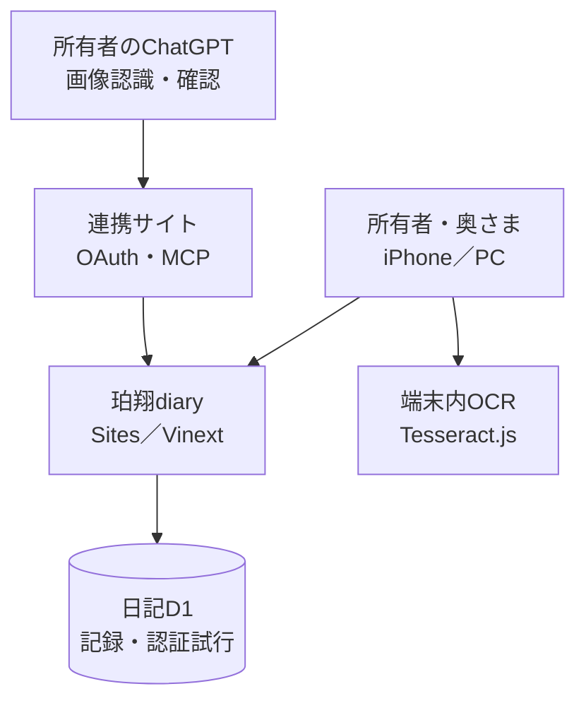
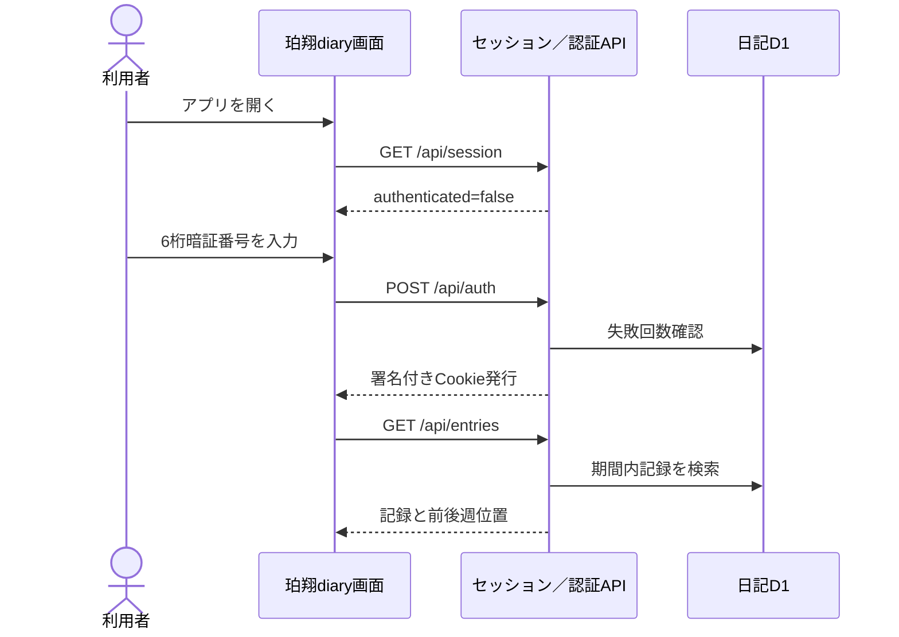
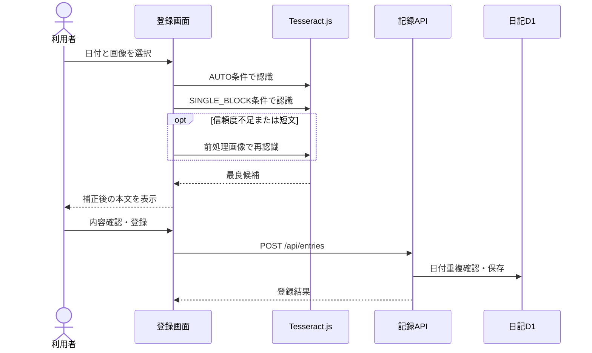
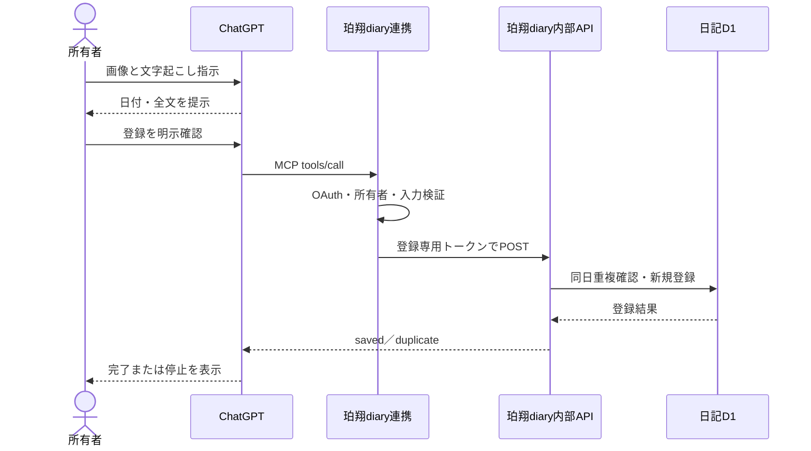
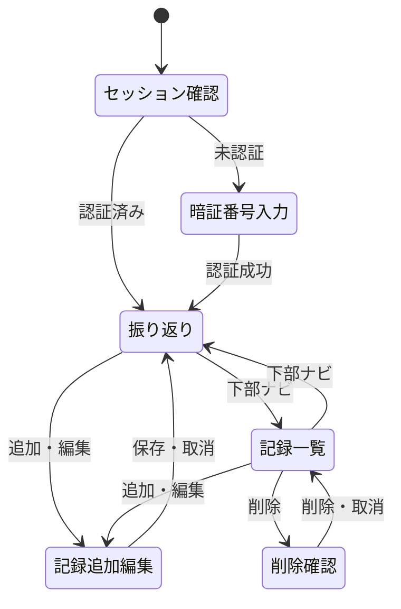
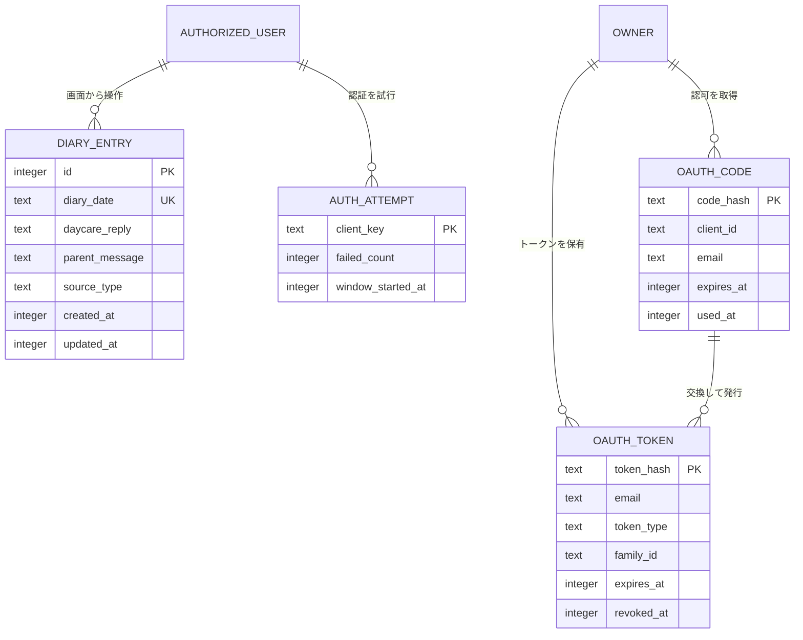

# 珀翔diary 基本設計書

## 1. 文書情報

| 項目 | 内容 |
|---|---|
| 文書名 | 珀翔diary 基本設計書 |
| 文書版 | 1.0 |
| 作成日 | 2026-09-07 |
| 設計対象 | 珀翔diary v11、珀翔diary連携 v1 |
| 本番URL | `https://hakuto-diary.hirokazu601218.chatgpt.site` |
| 連携URL | `https://hakuto-diary-connector.hirokazu601218.chatgpt.site` |
| 対象読者 | 利用者、保守担当者、開発担当者 |

## 2. 目的

珀翔diaryは、保育園と家庭の間で交わされた日々の連絡を日付単位で保存し、家族で過去の記録を振り返るための個人向けWebアプリケーションである。

本システムは、次の利用を目的とする。

- 「園からの返事」と「こちらからの連絡」を日付ごとに保存する。
- 最近、1週間前、1か月前、3か月前、半年前、1年以上前の記録を振り返る。
- 写真・スクリーンショットを端末内OCRで文字に変換する。
- 登録済み記録を編集・削除・Excel出力する。
- ChatGPTで画像を読み取り、利用者が確認した文章を個人用プラグインから直接登録する。

## 3. 設計範囲

### 3.1 対象範囲

- 珀翔diaryの画面およびAPI
- Cloudflare D1上の日記・認証試行データ
- ブラウザ内OCR
- ChatGPT向けMCPツール
- OAuth認証を提供する珀翔diary連携サイト
- 連携サイトから珀翔diaryへの登録専用通信
- ビルド、テスト、Sites公開に必要な構成

### 3.2 対象外

- OpenAI APIを利用したアプリ内AI OCR
- 画像ファイルの長期保存
- ChatGPTプラグインからの編集・削除
- 複数ユーザーが別々の日記帳を持つマルチテナント機能
- 通知、コメント、写真アルバム機能

## 4. 利用者と権限

| 利用者 | 主な利用経路 | 閲覧 | 画面からの登録・編集・削除 | ChatGPTからの登録 |
|---|---|---:|---:|---:|
| 所有者 | 珀翔diary、ChatGPT | 可 | 可 | 可 |
| 奥さま | 珀翔diary | 可 | 暗証番号認証後に可 | 不可 |
| 未許可利用者 | なし | 不可 | 不可 | 不可 |

補足：Sitesのアクセス制御は所有者と外部閲覧者を許可するカスタム設定である。アプリ画面のAPI操作には、さらに6桁暗証番号によるアプリ内認証を要求する。ChatGPT連携の書き込みは所有者のメールアドレスに限定する。

## 5. システム概要図

### 5.1 構成要素

| 構成要素 | 役割 |
|---|---|
| 珀翔diaryフロントエンド | 認証、振り返り、一覧、登録、編集、削除、OCR、Excel出力を提供する。 |
| 珀翔diary API | 暗証番号認証、セッション確認、日記データの取得・登録・更新・削除を提供する。 |
| 珀翔diary Worker | Vinextアプリの配信、画像最適化、MCPおよび内部登録経路を振り分ける。 |
| 日記D1 | `diary_entries`と`auth_attempts`を保持する。 |
| ブラウザ内OCR | 選択画像を端末内のTesseract.jsで読み取り、候補選択と固定ルール補正を行う。 |
| 珀翔diary連携 | ChatGPT向けOAuth認証、MCPツール公開、登録要求の中継を行う。 |
| 連携D1 | OAuth認可コードとアクセストークン／リフレッシュトークンのハッシュを保持する。 |
| ChatGPT個人用プラグイン | ChatGPTが確認済み文章を`register_diary_entry`ツールへ渡す。 |

## 6. システム方式

| 項目 | 採用方式 |
|---|---|
| フロントエンド | React 19、Next.js互換App Router、Vinext、TypeScript |
| UI | Tailwind CSS、Shadcn系UIコンポーネント、Lucide Icons |
| サーバー実行環境 | OpenAI Sites上のCloudflare Workers |
| データベース | Cloudflare D1（SQLite互換） |
| ORM・マイグレーション | Drizzle ORM、Drizzle Kit |
| 端末内OCR | Tesseract.js、日本語＋英語学習データ |
| Excel出力 | ExcelJS |
| ChatGPT連携 | MCP、OAuth 2.0 Authorization Code＋PKCE S256 |
| Webアプリ対応 | レスポンシブUI、Web App Manifest、Apple Web Appメタデータ |

## 7. 主要シーケンス図

### 7.1 暗証番号認証と記録表示

### 7.2 画面からの写真OCR登録

### 7.3 ChatGPTからの登録

## 8. 画面一覧

| 画面ID | 画面名 | 種別 | 概要 | 主な操作 |
|---|---|---|---|---|
| SC-01 | 起動・暗証番号画面 | ページ状態 | セッション確認中のローディングと6桁暗証番号入力を表示する。 | 暗証番号入力 |
| SC-02 | 振り返り画面 | メイン画面 | 指定時期の7日間、3行要約、日付別記録を表示する。 | 年・期間・前後週切替、7日分コピー、追加、編集 |
| SC-03 | 記録一覧画面 | メイン画面 | 全記録を新しい日付順で折りたたみ表示する。 | 展開、編集、削除、Excel出力、追加 |
| SC-04 | 記録追加・編集画面 | モーダル | 日付、園からの返事、こちらからの連絡を文字入力または写真OCRで編集する。 | OCR、登録、更新、キャンセル |
| SC-05 | 削除確認画面 | 確認モーダル | 対象日付を示し、削除の最終確認を行う。 | 削除、キャンセル |
| SC-C01 | 連携説明画面 | 公開ページ | ChatGPT連携の目的と画像・本文を保存しない旨を表示する。 | なし |
| SC-C02 | ChatGPTサインイン | Sites管理画面 | OAuth認可時に所有者を認証する。 | サインイン、許可 |

## 9. 画面遷移図

## 10. 画面基本設計

### 10.1 SC-01 起動・暗証番号画面

| 項目 | 内容 |
|---|---|
| 初期処理 | `/api/session`で有効なセッションCookieを確認する。 |
| 入力 | 6桁数字。6桁到達時に自動送信する。 |
| 成功時 | 振り返り画面へ切り替える。 |
| 失敗時 | 入力を消去し、エラーを表示する。 |
| 制限 | 同一接続元で10分以内に5回失敗した場合は一時停止する。 |

### 10.2 SC-02 振り返り画面

| 項目 | 内容 |
|---|---|
| 基準となる年 | 登録データに存在する年から選択肢を生成する。 |
| さらにさかのぼる | そのまま、1週間前、1か月前、3か月前、半年前。 |
| 表示単位 | 選択した基準日を中心とする7日間。最近のみ当日までの直近7日間。 |
| 前／次 | 単純な連続週ではなく、前後に記録が存在する週へ移動する。 |
| 1週間の様子 | 園からの返事から子ども中心の文章を最大3行抽出する。 |
| 7日分コピー | 日付、園からの返事、こちらからの連絡をテキスト形式でコピーする。 |
| 記録カード | 日付、登録方法、2種類の本文、編集ボタンを表示する。 |

### 10.3 SC-03 記録一覧画面

| 項目 | 内容 |
|---|---|
| 表示順 | 新しい日付順。 |
| 初期状態 | 各記録を要約1行の折りたたみ状態で表示する。 |
| 展開状態 | 登録方法、園からの返事、こちらからの連絡、編集・削除を表示する。 |
| Excel | 全件を`園に預けた日`、`園からの返事`、`こちらからの連絡`の3列で出力する。 |

### 10.4 SC-04 記録追加・編集画面

| 項目 | 内容 |
|---|---|
| 日付 | モーダル上部に配置し、追加時は端末の当日を初期値とする。 |
| 文字で入力 | 2つの本文欄へ直接入力・貼り付けする。 |
| 写真から | 画像を1枚選択し、端末内OCR後に2つの本文欄へ展開する。 |
| 重複 | 新規登録時に同日記録があれば上書き確認を表示する。 |
| 編集 | 対象IDを指定して更新し、別記録と同じ日付になる更新は拒否する。 |
| 入力条件 | 日付必須。2つの本文のうち少なくとも一方必須。 |

### 10.5 SC-05 削除確認画面

対象日付を表示し、取り消せない操作であることを明示する。削除は記録一覧画面からのみ開始できる。

## 11. 機能一覧

| 機能ID | 機能名 | 概要 | 利用経路 |
|---|---|---|---|
| FN-01 | セッション確認 | 起動時に暗証番号認証済みか確認する。 | 画面 |
| FN-02 | 暗証番号認証 | 6桁暗証番号を検証し、24時間有効なCookieを発行する。 | 画面 |
| FN-03 | 認証試行制限 | 接続元ごとの失敗回数を管理し総当たりを抑止する。 | API |
| FN-04 | 登録年取得 | 記録から存在年を抽出し、年選択肢を生成する。 | 画面・API |
| FN-05 | 期間別記録取得 | 指定条件の7日間と前後の記録位置を取得する。 | 画面・API |
| FN-06 | 前後週先読み | 前後に記録がある期間を事前取得する。 | 画面 |
| FN-07 | 期間キャッシュ | 最大12期間をメモリ保持し、切替表示を高速化する。 | 画面 |
| FN-08 | 週間要約 | 園からの返事から子ども中心の文章を最大3件抽出する。 | 画面 |
| FN-09 | 7日分コピー | 表示中の記録をクリップボードへ出力する。 | 画面 |
| FN-10 | 全記録一覧 | 全記録を取得して新しい日付順に表示する。 | 画面・API |
| FN-11 | 文字入力登録 | 日付と本文を新規登録する。 | 画面・API |
| FN-12 | 端末内OCR | 画像を複数条件で読み取り、最良候補を補正する。 | 画面 |
| FN-13 | 記録編集 | 既存記録の日付・本文・登録方法を更新する。 | 画面・API |
| FN-14 | 記録削除 | 対象IDの記録を確認後に削除する。 | 画面・API |
| FN-15 | Excelバックアップ | 全記録を`.xlsx`ファイルとして端末へ保存する。 | 画面 |
| FN-16 | OAuth認証 | ChatGPTクライアントと所有者を認証する。 | 連携 |
| FN-17 | MCPツール公開 | 登録専用ツールをChatGPTへ公開する。 | 連携 |
| FN-18 | ChatGPT新規登録 | 確認済みの文字情報を日記DBへ新規登録する。 | 連携 |
| FN-19 | ChatGPT重複拒否 | 同日記録を変更せず登録を停止する。 | 連携 |

## 12. 機能設計

### 12.1 認証

- Sitesアクセス制御で訪問者を所有者と奥さまに限定する。
- アプリ内APIでは、6桁暗証番号認証で発行したHMAC-SHA256署名Cookieを検証する。
- Cookieは`HttpOnly`、`Secure`、`SameSite=Lax`、有効期間24時間とする。
- 認証失敗の接続元IPは、セッション秘密値と組み合わせてSHA-256ハッシュ化して保存する。
- ChatGPT連携では、OAuth 2.0 Authorization CodeとPKCE S256を使用する。
- OAuth認可はChatGPTのクライアントと所有者メールだけに限定する。

### 12.2 記録管理

- 1日につき1レコードとし、`diary_date`に一意制約を設定する。
- 園からの返事、こちらからの連絡のどちらか一方だけでも登録できる。
- 画面の新規登録は、利用者確認後に既存レコード全体を上書きできる。
- 編集ではIDを指定し、日付変更後の重複を検査する。
- 削除ではIDの妥当性と対象存在を確認する。
- 登録・編集・削除後は期間キャッシュを全破棄して再取得する。

### 12.3 期間検索と高速化

- 期間取得APIは、対象期間の記録、直前の記録日、直後の記録日をD1の1回の`batch`で取得する。
- クライアントは検索条件をキーにして最大12期間を保持する。
- 表示対象の前後に記録がある場合、その週を非同期に先読みする。
- 連打時は進行中リクエストを`AbortController`で中止し、古い応答による表示逆転を防ぐ。
- キャッシュ世代番号により、更新前の先読み結果が更新後へ混入することを防ぐ。

### 12.4 端末内OCR

- OCRはブラウザ内で完結し、選択画像自体をサーバーへ保存しない。
- 日本語と英語を対象に、ページ全体解析と単一ブロック解析を実施する。
- 信頼度88未満または本文30文字未満の場合、拡大・グレースケール・コントラスト補正後に再認識する。
- OCR信頼度、本文量、表現記号、ノイズ文字を点数化し、最良候補を採用する。
- 余分な空白、改行、既知の誤認識だけを補正し、`先生より`直後へ改行を入れる。
- 顔文字・絵文字・音符等は可能な限り保持するが、最終確認を利用者に求める。

### 12.5 ChatGPT連携

- ChatGPTが画像を認識し、登録前に日付と全文を利用者へ提示する。
- 利用者が明示的に確認した後だけ登録ツールを呼び出す。
- 連携サイトへ送信するのは日付と文字情報だけで、画像は送信しない。
- プラグインは新規登録専用とし、編集・削除機能を公開しない。
- 同じ日付が存在する場合は既存データを変更せず停止する。
- 園からの返事、こちらからの連絡は各20,000文字以内とする。

## 13. テーブル一覧

### 13.1 日記D1

| テーブルID | テーブル名 | 用途 | 主キー | 主な制約 |
|---|---|---|---|---|
| TB-01 | `diary_entries` | 日付ごとの日記本文 | `id` | `diary_date`一意 |
| TB-02 | `auth_attempts` | 暗証番号認証の失敗回数 | `client_key` | 接続元ごとに1件 |

### 13.2 連携D1

| テーブルID | テーブル名 | 用途 | 主キー | 主な制約 |
|---|---|---|---|---|
| TB-C01 | `oauth_codes` | 一時的なOAuth認可コード | `code_hash` | 1回使用、2分で失効 |
| TB-C02 | `oauth_tokens` | アクセス／リフレッシュトークン | `token_hash` | `token_type`値制約 |

## 14. 項目定義書

### 14.1 TB-01 `diary_entries`

| No. | 論理名 | 物理名 | 型 | 必須 | 初期値 | 説明 |
|---:|---|---|---|---:|---|---|
| 1 | 日記ID | `id` | INTEGER | ○ | 自動採番 | 主キー。 |
| 2 | 園に預けた日 | `diary_date` | TEXT | ○ | なし | `YYYY-MM-DD`。一意。 |
| 3 | 園からの返事 | `daycare_reply` | TEXT | ○ | 空文字 | 園から受け取った原文。 |
| 4 | こちらからの連絡 | `parent_message` | TEXT | ○ | 空文字 | 家庭から園へ送った原文。 |
| 5 | 登録方法 | `source_type` | TEXT | ○ | `text` | `text`または`ocr`。ChatGPT連携は`ocr`。 |
| 6 | 作成日時 | `created_at` | INTEGER | ○ | なし | Unix時刻のミリ秒。 |
| 7 | 更新日時 | `updated_at` | INTEGER | ○ | なし | Unix時刻のミリ秒。 |

### 14.2 TB-02 `auth_attempts`

| No. | 論理名 | 物理名 | 型 | 必須 | 初期値 | 説明 |
|---:|---|---|---|---:|---|---|
| 1 | 接続元キー | `client_key` | TEXT | ○ | なし | 接続元IPと秘密値から生成したSHA-256相当の識別子。主キー。 |
| 2 | 失敗回数 | `failed_count` | INTEGER | ○ | `0` | 認証ウィンドウ内の失敗回数。 |
| 3 | ウィンドウ開始日時 | `window_started_at` | INTEGER | ○ | なし | Unix時刻のミリ秒。 |

### 14.3 TB-C01 `oauth_codes`

| No. | 論理名 | 物理名 | 型 | 必須 | 説明 |
|---:|---|---|---|---:|---|
| 1 | 認可コードハッシュ | `code_hash` | TEXT | ○ | 生コードを保存しない主キー。 |
| 2 | クライアントID | `client_id` | TEXT | ○ | 許可したChatGPTクライアント識別子。 |
| 3 | リダイレクトURI | `redirect_uri` | TEXT | ○ | ChatGPTのOAuth戻り先。 |
| 4 | 保護リソース | `resource` | TEXT | ○ | MCPエンドポイントURL。 |
| 5 | スコープ | `scope` | TEXT | ○ | `diary.write`。 |
| 6 | PKCEチャレンジ | `code_challenge` | TEXT | ○ | S256で検証する値。 |
| 7 | メールアドレス | `email` | TEXT | ○ | 認証済み所有者メール。小文字化して保存。 |
| 8 | 有効期限 | `expires_at` | INTEGER | ○ | 発行から2分。 |
| 9 | 使用日時 | `used_at` | INTEGER | － | 未使用はNULL。使用時に記録。 |

### 14.4 TB-C02 `oauth_tokens`

| No. | 論理名 | 物理名 | 型 | 必須 | 説明 |
|---:|---|---|---|---:|---|
| 1 | トークンハッシュ | `token_hash` | TEXT | ○ | 生トークンを保存しない主キー。 |
| 2 | メールアドレス | `email` | TEXT | ○ | 認証済み所有者メール。 |
| 3 | スコープ | `scope` | TEXT | ○ | `diary.write`。 |
| 4 | トークン種別 | `token_type` | TEXT | ○ | `access`または`refresh`。 |
| 5 | トークンファミリーID | `family_id` | TEXT | ○ | 更新前後のトークン系列を識別する。 |
| 6 | 有効期限 | `expires_at` | INTEGER | ○ | accessは1時間、refreshは30日。 |
| 7 | 失効日時 | `revoked_at` | INTEGER | － | 有効中はNULL。 |
| 8 | 作成日時 | `created_at` | INTEGER | ○ | Unix時刻のミリ秒。 |

## 15. ER図

物理データベース上に外部キーは設定していない。次図の関連は業務上の論理関係を示す。

## 16. 外部インターフェース一覧

| IF-ID | インターフェース | 方式 | 認証 | 用途 |
|---|---|---|---|---|
| IF-01 | `/api/session` | HTTPS／JSON | セッションCookie | 認証状態確認 |
| IF-02 | `/api/auth` | HTTPS／JSON | PIN | セッション発行 |
| IF-03 | `/api/entries` | HTTPS／JSON | セッションCookie | 記録取得・登録・更新・削除 |
| IF-04 | `/internal/register` | HTTPS／JSON | Service Bearer＋Sites認可 | 連携サイトからの新規登録 |
| IF-05 | `/api/mcp` | MCP／JSON-RPC | OAuth Bearer | ChatGPT向け登録ツール |
| IF-06 | OAuthメタデータ | HTTPS／JSON | なし | ChatGPTの認証自動検出 |
| IF-07 | `/oauth/authorize` | OAuth 2.0 | ChatGPTサインイン | 所有者認可 |
| IF-08 | `/oauth/token` | OAuth 2.0 | PKCE | トークン発行・更新 |

## 17. 非機能設計

### 17.1 セキュリティ

- 日記サイトはSitesのカスタムアクセス制御で限定公開する。
- 暗証番号、セッション秘密値、連携トークンは環境変数の秘密値として保持する。
- APIキーや秘密値をブラウザ、Git、ログ、レスポンスへ出力しない。
- SQLはD1 prepared statementとバインド変数を使用する。
- OAuth認可コード・トークンはハッシュだけをD1へ保存する。
- ChatGPTプラグインには編集・削除ツールを公開しない。
- 連携サイトは公開だが、書き込みはOAuth所有者確認と登録専用トークンの二段階で制御する。

### 17.2 性能

- 期間検索は3検索をD1 `batch`で1往復にまとめる。
- 表示期間キャッシュは最大12件に制限する。
- 前後の記録週を先読みする。
- 古い通信を中断し、最後に選択した期間だけを画面へ反映する。
- ExcelJSとTesseract.jsは必要時に動的読込する。

### 17.3 可用性・障害時動作

- 先読み失敗は画面表示を妨げず、実際の移動時に通常取得する。
- API・OCR・Excel出力失敗時はトーストで再試行可能なメッセージを表示する。
- データベース接続不可時はAPIエラーとし、ブラウザ内データを正本にしない。
- 登録・更新・削除後はサーバーから再取得して整合を取る。

### 17.4 操作性・互換性

- iPhoneを主要端末とし、モバイル優先のレスポンシブ構成とする。
- PCでは本文領域の最大幅を制限し、可読性を維持する。
- 日付形式は画面上`YYYY/MM/DD（曜日）`、API・DB上`YYYY-MM-DD`とする。
- ボタン、入力欄、モーダルにアクセシブルなラベルを設定する。

### 17.5 プライバシー

- 現行のアプリ内OCRは端末内で処理し、画像を日記サーバーへ保存しない。
- ChatGPT連携では画像はChatGPT側で処理し、連携サイトと日記サイトへは確定文字だけを送る。
- D1には日付と本文を保存し、画像ファイルは保存しない。

## 18. 制約・既知事項

- Tesseract.jsは一般OCRであり、顔文字、音符、絵文字、記号を完全には認識できない。
- 週間要約はAI要約ではなく、登録本文から最大3文を規則抽出する。
- ChatGPT連携は同日記録への追記・更新を行わず、既存日付があれば停止する。
- 画面からの上書きはレコード全体を置き換えるため、確認画面の内容を十分確認する。
- 将来のOpenAI APIによる完全自動OCRは現行版に含まれない。

## 19. 将来拡張候補

- 同日レコードの空欄項目だけを安全に追記する連携ツール
- 複数画像・複数日をアプリ内で一括確認して登録する機能
- Zero Data Retention承認後のOpenAI API画像認識
- 文字一致率、記号一致率、判読不明率のOCR評価機能
- Excelバックアップからの復元機能

