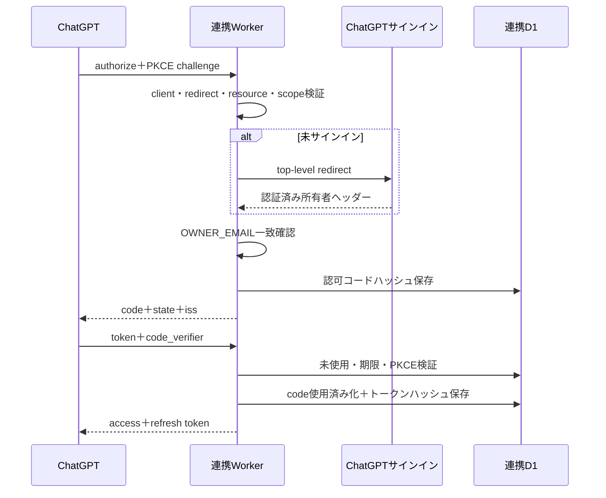

# 珀翔diary 詳細設計書

## 1. 文書情報

| 項目 | 内容 |
|---|---|
| 文書名 | 珀翔diary 詳細設計書 |
| 文書版 | 1.0 |
| 作成日 | 2026-09-07 |
| 対応する基本設計 | `docs/basic-design.md` 1.0 |
| 対象ソース | 珀翔diary v11、`connector/` 珀翔diary連携 v1 |

## 2. アプリケーション構成

```text
HakutoDiary/
├── app/                         # 画面、スタイル、画面用API
│   ├── api/auth/route.ts        # 暗証番号認証
│   ├── api/entries/route.ts     # 記録CRUD・期間検索
│   ├── api/session/route.ts     # セッション確認
│   ├── diary-app.tsx            # クライアント画面とOCR・Excel処理
│   ├── globals.css              # アプリ固有スタイル
│   ├── layout.tsx               # メタデータ、Viewport
│   └── page.tsx                 # ルートページ
├── components/ui/               # UIプリミティブ
├── db/                          # Drizzleスキーマ、DB取得
├── drizzle/                     # 日記D1マイグレーション
├── lib/
│   ├── database.ts              # D1バインディング取得
│   ├── mcp.ts                   # 日記側MCP・登録処理
│   └── session.ts               # Cookie署名・検証
├── worker/index.ts              # Cloudflare Worker入口
├── tests/                       # ビルド・UI・MCPテスト
├── connector/                   # ChatGPT連携サイト一式
│   ├── worker/index.js          # OAuth、MCP、中継処理
│   ├── drizzle/                 # 連携D1マイグレーション
│   └── tests/                   # 連携テスト
├── docs/                        # 設計書
└── .openai/hosting.json         # 珀翔diary Sites設定
```

## 3. モジュール一覧

| モジュールID | ファイル | 責務 |
|---|---|---|
| MD-01 | `app/diary-app.tsx` | 画面状態、期間検索、OCR、登録・編集・削除、コピー、Excel出力 |
| MD-02 | `app/api/auth/route.ts` | PIN検証、失敗回数制限、セッションCookie発行 |
| MD-03 | `app/api/session/route.ts` | セッションCookieの有効性返却 |
| MD-04 | `app/api/entries/route.ts` | 登録年・期間・全件取得、POST、PATCH、DELETE |
| MD-05 | `lib/session.ts` | 秘密値取得、HMAC署名、Cookie検証、接続元キー生成 |
| MD-06 | `lib/database.ts` | Worker環境のD1 `DB`バインディング取得 |
| MD-07 | `lib/mcp.ts` | MCPプロトコル、メール許可、登録ツール、重複防止 |
| MD-08 | `worker/index.ts` | `/internal/register`、`/mcp`、画像最適化、Vinextへのルーティング |
| MD-09 | `db/schema.ts` | 日記D1のDrizzleスキーマ |
| MD-C01 | `connector/worker/index.js` | OAuthメタデータ、認可、トークン、MCP、中継 |
| MD-C02 | `connector/drizzle/0000_hakuto_oauth.sql` | 連携D1スキーマ・索引 |

## 4. クライアント状態設計

### 4.1 主要状態

| 状態名 | 型 | 初期値 | 用途 |
|---|---|---|---|
| `checkingSession` | boolean | `true` | 起動時セッション確認中 |
| `authenticated` | boolean | `false` | アプリ内PIN認証状態 |
| `pin` | string | `""` | 6桁PIN入力 |
| `view` | `memory \| list` | `memory` | 振り返り／一覧切替 |
| `yearsAgo` | string | `""` | 基準年の現在年からの差 |
| `availableYearOffsets` | number[] | `[]` | DBの存在年から生成した選択肢 |
| `offsetKey` | string | `none` | 追加のさかのぼり条件 |
| `weekShift` | number | `0` | 基準期間からの週移動量 |
| `data` | EntriesResponse\|null | `null` | 表示中7日間のデータ |
| `allEntries` | Entry[] | `[]` | 一覧表示データ |
| `formOpen` | boolean | `false` | 追加・編集モーダル |
| `editingEntry` | Entry\|null | `null` | 編集対象 |
| `deleteTarget` | Entry\|null | `null` | 削除対象 |
| `mode` | `text \| ocr` | `text` | 入力方式 |
| `diaryDate` | string | 端末の当日 | 入力日付 |
| `daycareReply` | string | `""` | 園からの返事 |
| `parentMessage` | string | `""` | こちらからの連絡 |
| `ocrProgress` | number | `0` | OCR進捗率 |
| `ocrReady` | boolean | `false` | OCR結果確認可能状態 |

### 4.2 参照オブジェクト

| 参照名 | 内容 |
|---|---|
| `pinRequest` | PIN二重送信を防止する。 |
| `periodCache` | 検索条件キーから期間応答を保持する。最大12件。 |
| `periodCacheGeneration` | 更新前後のキャッシュ世代を識別する。 |
| `pendingPrefetches` | 同じ先読みの二重実行を防止する。 |
| `activePeriodRequest` | 進行中の表示用通信を中止する。 |

## 5. データ型

### 5.1 `Entry`

```ts
type Entry = {
  id: number;
  diaryDate: string;
  daycareReply: string;
  parentMessage: string;
  sourceType: "text" | "ocr";
};
```

### 5.2 `EntriesResponse`

```ts
type EntriesResponse = {
  entries: Entry[];
  startDate: string;
  endDate: string;
  previousWeekShift: number | null;
  nextWeekShift: number | null;
};
```

## 6. API詳細設計

すべてHTTPSで提供する。画面用APIは有効な`hakuto_diary_session` Cookieを必要とする。

### 6.1 IF-01 セッション確認

| 項目 | 内容 |
|---|---|
| URL | `/api/session` |
| Method | GET |
| 応答 | `{ "authenticated": boolean }` |
| 処理 | Cookieの期限、署名長、HMAC署名を確認する。 |

### 6.2 IF-02 暗証番号認証

| 項目 | 内容 |
|---|---|
| URL | `/api/auth` |
| Method | POST |
| Content-Type | `application/json` |
| 要求 | `{ "pin": "6桁暗証番号" }` |
| 成功 | 200、`{ "authenticated": true }`、署名付きCookie |
| PIN不一致 | 401、`暗証番号が違います。` |
| 試行超過 | 429、10分後の再試行案内 |

#### 認証試行アルゴリズム

1. `cf-connecting-ip`、次に`x-forwarded-for`を接続元とする。なければ`unknown`とする。
2. 接続元とセッション秘密値を連結しSHA-256でハッシュ化する。
3. `auth_attempts`の現在ウィンドウを取得する。
4. 10分未満かつ失敗回数5回以上なら429を返す。
5. PIN不一致時は新規ウィンドウを1回で開始、または失敗回数を加算する。
6. PIN一致時は試行レコードを削除し、24時間Cookieを発行する。

### 6.3 IF-03-1 登録年取得

| 項目 | 内容 |
|---|---|
| URL | `/api/entries?years=1` |
| Method | GET |
| 応答 | `{ "years": [2026, 2025, ...] }` |
| SQL要点 | `diary_date`先頭4桁のDISTINCTを降順取得 |

### 6.4 IF-03-2 全件取得

| 項目 | 内容 |
|---|---|
| URL | `/api/entries?all=1` |
| Method | GET |
| 応答 | `{ "entries": Entry[] }` |
| DB順序 | `diary_date ASC` |
| 画面順序 | クライアントで反転し新しい日付順 |

### 6.5 IF-03-3 期間取得

| 項目 | 内容 |
|---|---|
| URL | `/api/entries` |
| Method | GET |
| クエリ | `monthsAgo`、`daysAgo`、`weekShift`、`referenceDate` |
| 上限 | `monthsAgo` 0～240、`daysAgo` 0～365、`weekShift` -520～520 |
| 応答 | 対象記録、開始日、終了日、前後の記録週位置 |

#### 期間算定

1. `referenceDate`が`YYYY-MM-DD`なら使用し、不正ならUTC当日を使う。
2. `monthsAgo`分を減算する。対象月に同じ日がなければ月末へ丸める。
3. `daysAgo`分を減算し、`weekShift × 7`日を加算する。
4. `monthsAgo=0`かつ`daysAgo=0`なら、算定日を終了日として6日前を開始日にする。
5. それ以外は算定日を開始日として6日後を終了日にする。
6. D1 `batch`で対象、開始日前の最大日、終了日後の最小日を取得する。
7. 前後記録との日数差を7で切り上げ、移動先`weekShift`を算定する。

### 6.6 IF-03-4 新規登録・上書き

| 項目 | 内容 |
|---|---|
| URL | `/api/entries` |
| Method | POST |
| 要求 | `diaryDate`、`daycareReply`、`parentMessage`、`sourceType`、`overwrite` |
| 成功 | 200、`{ "saved": true }` |
| 重複 | `overwrite=false`時は409、`duplicate=true` |
| 上書き | `overwrite=true`時は既存IDの本文・登録方法・更新日時を更新 |

### 6.7 IF-03-5 編集

| 項目 | 内容 |
|---|---|
| URL | `/api/entries` |
| Method | PATCH |
| 要求 | `id`、日付、2本文、登録方法 |
| 成功 | 200、`saved=true` |
| 入力不正 | 400 |
| 別レコードと日付重複 | 409 |
| 対象なし | 404 |

### 6.8 IF-03-6 削除

| 項目 | 内容 |
|---|---|
| URL | `/api/entries` |
| Method | DELETE |
| 要求 | `{ "id": number }` |
| 成功 | 200、`deleted=true` |
| ID不正 | 400 |
| 対象なし | 404 |

### 6.9 IF-04 内部登録

| 項目 | 内容 |
|---|---|
| URL | `/internal/register` |
| Method | POST |
| 認証 | `Authorization: Bearer <登録専用トークン>`、Sites間認可ヘッダー |
| 要求 | `diary_date`、`daycare_reply`、`parent_message` |
| 成功 | MCP形式の本文＋`structuredContent.saved=true` |
| 重複 | `saved=false`、`duplicate=true`。既存データは変更しない。 |

### 6.10 IF-05 MCP

| 項目 | 内容 |
|---|---|
| URL | 連携サイトの`/api/mcp` |
| Method | POST |
| 形式 | JSON-RPC 2.0、MCP streamable HTTP |
| 認証 | OAuth 2.0 Bearer、`diary.write`スコープ |
| 対応メソッド | `initialize`、`notifications/initialized`、`ping`、`tools/list`、`tools/call` |
| 公開ツール | `register_diary_entry`のみ |

#### `register_diary_entry`入力

| 項目 | 型 | 必須 | 制約 |
|---|---|---:|---|
| `diary_date` | string | ○ | `YYYY-MM-DD`、実在日 |
| `daycare_reply` | string | ○ | 最大20,000文字。空文字可。 |
| `parent_message` | string | ○ | 最大20,000文字。空文字可。 |

2本文の両方が空文字の場合は拒否する。書き込みツールの注釈は、非読取専用、非破壊、同じ日付に対して冪等、外部影響なしとする。

## 7. OAuth詳細設計

### 7.1 エンドポイント

| URL | Method | 機能 |
|---|---|---|
| `/.well-known/oauth-protected-resource` | GET | MCP保護リソース情報 |
| `/.well-known/oauth-protected-resource/api/mcp` | GET | MCPパス対応の保護リソース情報 |
| `/.well-known/oauth-authorization-server` | GET | 認可サーバーメタデータ |
| `/oauth/authorize` | GET | 認可コード発行 |
| `/oauth/token` | POST | 認可コード交換、更新トークン交換 |

### 7.2 認可コードフロー



### 7.3 セキュリティ条件

- ChatGPT公式クライアントID／リダイレクトURIの組み合わせだけを許可する。
- `response_type=code`、`code_challenge_method=S256`を必須とする。
- `resource`は連携サイトの`/api/mcp`と完全一致させる。
- `scope`は`diary.write`を必須とする。
- 認証済みメールが`OWNER_EMAIL`と一致しない場合は403とする。
- 認可コードは2分、アクセストークンは1時間、リフレッシュトークンは30日で失効する。
- リフレッシュトークンは使用時に失効させ、新しいトークン対へローテーションする。
- 生のコードとトークンはD1へ保存せず、SHA-256ハッシュを保存する。

## 8. 端末内OCR詳細設計

### 8.1 入力

- ファイル入力は`accept="image/*"`とする。
- 現行画面では1回につき1画像を処理する。
- 画像はブラウザメモリ上だけで扱い、APIへ送信しない。

### 8.2 認識処理

| 順序 | 条件 | Tesseract設定 | 目的 |
|---:|---|---|---|
| 1 | 常時 | `jpn+eng`、`PSM.AUTO`、自動回転、300dpi | ページ全体を認識 |
| 2 | 常時 | `PSM.SINGLE_BLOCK`、自動回転 | 記号を含む本文ブロック候補 |
| 3 | 信頼度<88または本文<30文字 | 前処理画像、`PSM.AUTO` | 低品質画像の再試行 |

### 8.3 画像前処理

1. `URL.createObjectURL`でローカル画像を開く。
2. 長辺を最大2倍かつ2,400px以内に拡大・縮小する。
3. Canvasへ描画する。
4. RGBを`0.299R + 0.587G + 0.114B`でグレースケール化する。
5. `(gray - 128) × 1.35 + 128`でコントラストを調整する。
6. JPEG品質0.94のBlobを生成する。
7. Object URLを必ず解放する。

### 8.4 候補評価

基本点をTesseract信頼度とし、次を加減算する。

| 評価項目 | 点数への影響 |
|---|---|
| 意味のある文字数 | 最大＋8 |
| 顔文字・音符等の表現記号 | 最大＋5 |
| 文字化け・罫線様記号 | 1件－5 |
| 同一文字の過剰反復 | 1件－3 |
| `人笑)`等の壊れた表現 | 1件－4 |
| 文末の不自然な括弧記号 | －3 |

評価点が最大の候補を採用する。

### 8.5 文字正規化

- Unicode NFCへ正規化する。
- ゼロ幅文字、余分なタブ、半角・全角空白を除去・集約する。
- 日本語文字間のOCR由来空白を削除する。
- 句読点・閉じ括弧前、開き括弧後の空白を削除する。
- 画像の行折返しをつなぐ。英数字同士の境界だけ必要に応じて1空白を残す。
- `先生より`の直後に改行を1つ設定する。
- 既知誤りとして、カラー、ボール、パーテーション、`(笑)`、全角疑問符・感嘆符、文末音符等を限定補正する。

### 8.6 2項目分離

正規化後の文章から`園から`、`保育園から`、`先生から`に続く返事・返信・連絡の見出しを検索する。

- 見出しが途中にある：前半を`parentMessage`、後半を`daycareReply`とする。
- 見出しがない：全文を`daycareReply`とし、`parentMessage`を空にする。

## 9. 振り返り・要約設計

### 9.1 年選択肢

現在年からDB内の各登録年を減算して`yearsAgo`候補を作る。重複を除いて昇順とする。登録のない年は表示しない。

### 9.2 期間ラベル

| 条件 | 表示例 |
|---|---|
| 年差0・追加なし | 最近 |
| 年差0・7日前 | 1週間前 |
| 年差1・7日前 | 1年1週間前 |
| 合計月6 | 半年前 |
| 合計月18 | 1年半前 |
| その他 | N年前、Nか月前、N年Nか月前 |

### 9.3 週間3行要約

1. 園からの返事を正規化する。
2. `先生より`を含む署名・見出しを除く。
3. 句点、疑問符、感嘆符、改行で文章へ分割する。
4. ママ、パパ、保護者、家庭、先生等を主題とする文章を除外する。
5. 各日から1文ずつ巡回取得し、重複なしで最大3文を表示する。
6. 子ども中心の文章がない場合は除外前の文章を使用する。

この処理はAIによる要約ではなく、既存本文の抽出である。

## 10. キャッシュ・通信制御設計

### 10.1 キャッシュキー

`monthsAgo:daysAgo:weekShift:referenceDate`を連結してキーとする。

### 10.2 保持ルール

- `Map`の末尾を最新利用とみなす。
- 登録時は既存キーを削除して末尾へ再挿入する。
- 12件を超えた場合は最古キーを削除する。

### 10.3 競合防止

- 表示条件が変わるたび、既存の`AbortController`を中止する。
- 応答時にコントローラーが現在値と一致しない場合は画面へ反映しない。
- 登録・編集・削除時は世代番号を加算し、キャッシュを全消去する。
- 先読み開始時の世代と完了時の世代が異なる場合は保存しない。
- 先読み失敗は無視し、実表示要求で再取得する。

## 11. Excelバックアップ設計

| 項目 | 内容 |
|---|---|
| ライブラリ | ExcelJS（操作時に動的読込） |
| シート名 | `珀翔diary` |
| 列 | 園に預けた日、園からの返事、こちらからの連絡 |
| 日付形式 | `YYYY/MM/DD` |
| 見出し | 太字、白文字、濃青背景 |
| 本文 | 上寄せ、折返し |
| ファイル名 | `珀翔diary_バックアップ_YYYYMMDD.xlsx` |
| 生成場所 | ブラウザメモリ |

## 12. データベース物理設計

### 12.1 日記D1 DDL

```sql
CREATE TABLE diary_entries (
  id INTEGER PRIMARY KEY AUTOINCREMENT NOT NULL,
  diary_date TEXT NOT NULL,
  daycare_reply TEXT DEFAULT '' NOT NULL,
  parent_message TEXT DEFAULT '' NOT NULL,
  source_type TEXT DEFAULT 'text' NOT NULL,
  created_at INTEGER NOT NULL,
  updated_at INTEGER NOT NULL
);
CREATE UNIQUE INDEX idx_diary_entries_date
  ON diary_entries (diary_date);

CREATE TABLE auth_attempts (
  client_key TEXT PRIMARY KEY NOT NULL,
  failed_count INTEGER DEFAULT 0 NOT NULL,
  window_started_at INTEGER NOT NULL
);
```

### 12.2 連携D1 DDL概要

| テーブル | 索引 |
|---|---|
| `oauth_codes` | 主キー`code_hash`、`idx_oauth_codes_expires_at` |
| `oauth_tokens` | 主キー`token_hash`、`idx_oauth_tokens_expires_at`、`idx_oauth_tokens_family_id` |

`oauth_tokens.token_type`には`access`または`refresh`のCHECK制約を設定する。マイグレーション末尾で`PRAGMA optimize`を実行する。

## 13. 環境設定

秘密値はSitesの実行環境へ設定し、Git管理しない。

### 13.1 珀翔diary

| 設定名 | 秘密 | 用途 |
|---|---:|---|
| `DB` | － | 日記D1バインディング |
| `HAKUTO_DIARY_PIN` | ○ | 6桁暗証番号 |
| `HAKUTO_SESSION_SECRET` | ○ | Cookie署名と接続元ハッシュ |
| `HAKUTO_MCP_ALLOWED_EMAILS` | ○ | 日記側MCPの許可メール一覧 |
| `HAKUTO_CONNECTOR_SERVICE_TOKEN` | ○ | `/internal/register`認証 |

### 13.2 珀翔diary連携

| 設定名 | 秘密 | 用途 |
|---|---:|---|
| `DB` | － | OAuth D1バインディング |
| `OWNER_EMAIL` | ○ | ChatGPT連携を許可する所有者 |
| `DIARY_SERVICE_URL` | － | 日記側`/internal/register` URL |
| `DIARY_SERVICE_TOKEN` | ○ | 日記側登録専用トークン |
| `DIARY_SITE_BYPASS_BEARER` | ○ | 限定公開SiteへのSites認可 |

## 14. エラー設計

| 場面 | 主な状態 | 利用者表示・処理 |
|---|---|---|
| PIN不一致 | 401 | 入力を消去しエラー表示 |
| PIN試行超過 | 429 | 10分後の再試行を案内 |
| セッション切れ | 401 | 暗証番号画面へ戻す |
| 記録入力不足 | 400 | APIメッセージをトースト表示 |
| 新規日付重複 | 409 | 画面は上書き確認、ChatGPT連携は停止 |
| 編集日付重複 | 409 | 更新せずエラー表示 |
| 記録なし | 404 | 編集・削除対象なしを表示 |
| OCR失敗 | クライアント例外 | 別画像または文字入力を案内 |
| 先読み失敗 | 通信例外 | 表示を維持し、移動時に通常取得 |
| Excel生成失敗 | クライアント例外 | 作成できない旨を表示 |
| OAuth入力不正 | 400 | OAuthエラーまたは本文表示 |
| OAuth未認証 | 401 | OAuth challengeを返す |
| 所有者不一致 | 403 | 利用権限なしを返す |
| 日記サービス接続失敗 | 非2xx | `service_unavailable`を返す |

## 15. セキュリティ詳細

### 15.1 防御層

1. Sitesアクセス許可：日記サイトの閲覧者を限定する。
2. アプリPIN：画面用APIの利用を制限する。
3. 署名Cookie：改ざん・期限切れを拒否する。
4. PINレート制限：総当たりを抑止する。
5. OAuth：ChatGPT連携元と所有者を確認する。
6. 連携サービス用Bearer：連携サイト以外からの内部登録を拒否する。
7. D1一意制約：同日の二重登録を最終層でも防止する。

### 15.2 秘密情報管理

- 秘密値をソース、設計書、Git履歴、クライアントJavaScriptへ記載しない。
- 登録専用トークンは日記側と連携側で同じ秘密を安全に設定する。
- OAuthトークンは応答時だけ平文で扱い、D1にはハッシュを保存する。
- 比較対象のBearerは双方をSHA-256化し、バイト単位の差分集約で比較する。

### 15.3 データ保護

- 日記本文はD1へ保存する。
- OCR画像は端末内処理後に破棄し、D1・R2へ保存しない。
- ChatGPT連携は画像を中継せず、利用者確認済み文字だけを送る。
- 画面用APIは`cache: no-store`で取得する。

## 16. テスト設計

### 16.1 自動テスト

| テストID | 対象 | 確認内容 |
|---|---|---|
| TS-01 | ビルド | Worker形式の成果物を生成できること |
| TS-02 | HTML | 開発プレビューメタデータとHTML Content-Type |
| TS-03 | UIプリミティブ | CSSユーティリティ、ProgressのARIA、テーマ、スケルトンの再現性 |
| TS-04 | 日記MCP | 公開ツールが新規登録だけであること |
| TS-05 | 日記MCP権限 | 許可外メールを403にすること |
| TS-06 | 日記MCP重複 | 初回登録成功、同日2回目停止 |
| TS-07 | 内部登録認証 | Service Bearerなしを拒否し、正しい値で登録すること |
| TS-C01 | OAuthメタデータ | issuer、PKCE S256、`diary.write`公開 |
| TS-C02 | MCP認証 | BearerなしでOAuth challengeを返すこと |
| TS-C03 | OAuth接続元 | ChatGPT以外のclient／redirectを拒否すること |

### 16.2 手動受入観点

- iPhoneで横スクロールやボタン切れが発生しない。
- 登録年が実データから生成される。
- 前後ボタンが記録の存在する週へ移動する。
- 期間を連打しても古い応答へ戻らない。
- 登録・編集・削除後に最新内容が表示される。
- OCR後、顔文字、音符、感嘆符、`先生より`後の改行を確認できる。
- Excelファイルを開き、日本語本文と3列が保持される。
- 所有者と奥さま以外は日記サイトへアクセスできない。
- ChatGPT連携は所有者だけが使え、登録前の確認後だけ書き込む。

## 17. ビルド・配置設計

### 17.1 珀翔diary

- `npm run build`でVinextアプリをCloudflare Worker互換成果物へ変換する。
- `.openai/hosting.json`はD1論理バインディング`DB`を宣言する。
- Workerのdefault exportは`fetch(request, env, ctx)`を提供する。
- DrizzleマイグレーションをSites公開時に適用する。

### 17.2 珀翔diary連携

- 依存ライブラリを持たないBuildless Workerとする。
- `scripts/build.sh`で`worker/index.js`とHosting設定を`dist/`へコピーする。
- `scripts/validate-artifact.mjs`でWorker入口を検証する。
- 独立したD1へOAuthコード・トークン情報を保存する。

## 18. 変更管理上の注意

- 適用済みDrizzleマイグレーションは変更せず、新しい変更は追加マイグレーションとする。
- `diary_date`一意制約を維持する。
- MCPツール追加時は、読取・更新・削除の権限と確認方法を個別に設計する。
- MCPツール定義やOAuthメタデータ変更後はChatGPT側プラグインを更新する。
- 画面登録とChatGPT登録では重複時の動作が異なるため、変更時は両方を試験する。
- OCR補正ルール追加時は、正しい原文を誤変換しない回帰画像を用意する。

## 19. 現行仕様と将来仕様の境界

| 項目 | 現行v11 | 将来候補 |
|---|---|---|
| アプリ内画像認識 | Tesseract.js、端末内 | OpenAI API、サーバー経由 |
| 画像選択 | 1枚 | 複数枚・複数日 |
| AI API料金 | なし | 画像ごとの従量課金 |
| ChatGPT連携 | 確認済み文字の新規登録 | 同日の空欄項目だけを追記 |
| 重複時 | 画面は確認上書き、連携は停止 | 項目単位の競合判定 |
| 画像保存 | なし | 原則なしを維持 |

